Round-Robin
-----------

Shale
~~~~~

The Tomography Round-Robin data sets :cite:`round-robin:17` consist of two shale samples obtained from the North Sea (sample N1) and the Upper Barnett Formation in Texas (sample B1) :cite:`Kanitpanyacharoen:13`. Shale is a challenging material because of its multiphase composition, small grain size, low but significant amount of porosity, as well as strong shape- and lattice-preferred orientation. The goals of this round-robin project were to (i) characterize microstructures and porosity on the micrometer scale, (ii) compare results measured at three synchrotron facilities, and (iii) identify optimal experimental conditions of high-resolution tomography (microCT) for fine-grained materials. microCT data of these shales were acquired under similar conditions at the Advanced Photon Source (APS) of Argonne National Laboratory, USA, at the Swiss Light Source (SLS) of the Paul Scherrer Institut, Switzerland and at the Advanced Light Source (ALS) of Lawrence Berkeley National Laboratory, USA with the goal to compare the data quality and determine phase proportions and microstructures differences from the same samples as measured at the three facilities. All instruments used a 10× objective lens with an effective pixel size of ~ 0.7 µm. The Round-Robin Data Sets consists of one measurement of sample N1 and one measurement of sample B1 taken at all three facilities for a total of 6 tomographic data sets.

To load the data sets and perform a basic reconstruction using tomoPy  :cite:`Gursoy:14a` use the 
:download:`tomopy_rec.py <../../demo/tomopy_rec.py>` python script.

Example: ::

    tomopy recon --file-name /tomobank/tomo_00001.h5 --rotation-axis 1024

.. |d00001| image:: ../img/tomo_00001.png
    :width: 20pt
    :height: 20pt
.. |d00002| image:: ../img/tomo_00002.png
    :width: 20pt
    :height: 20pt
.. |d00003| image:: ../img/tomo_00003.png
    :width: 20pt
    :height: 20pt
.. |d00004| image:: ../img/tomo_00004.png
    :width: 20pt
    :height: 20pt
    

.. _tomo_00001: https://app.globus.org/file-manager?origin_id=9f00a780-4aee-42a7-b7f4-6a2773c8da30&origin_path=%2Ftomo_00001_to_00006%2F
.. _tomo_00002: https://app.globus.org/file-manager?origin_id=9f00a780-4aee-42a7-b7f4-6a2773c8da30&origin_path=%2Ftomo_00001_to_00006%2F
.. _tomo_00003: https://app.globus.org/file-manager?origin_id=9f00a780-4aee-42a7-b7f4-6a2773c8da30&origin_path=%2Ftomo_00001_to_00006%2F
.. _tomo_00004: https://app.globus.org/file-manager?origin_id=9f00a780-4aee-42a7-b7f4-6a2773c8da30&origin_path=%2Ftomo_00001_to_00006%2F
.. _tomo_00005: https://app.globus.org/file-manager?origin_id=9f00a780-4aee-42a7-b7f4-6a2773c8da30&origin_path=%2Ftomo_00001_to_00006%2F
.. _tomo_00006: https://app.globus.org/file-manager?origin_id=9f00a780-4aee-42a7-b7f4-6a2773c8da30&origin_path=%2Ftomo_00001_to_00006%2F

+---------------+----------------+------------------+--------------+-----------+-------------------------+
|    Tomo ID    |    Facility    |    Sample        |   Scan Name  |   Image   |          Axis           |
+---------------+----------------+------------------+--------------+-----------+-------------------------+
| tomo_00001_   |        APS     |       B1         |    hornby    |  |d00001| |          1024           |
+---------------+----------------+------------------+--------------+-----------+-------------------------+
| tomo_00002_   |        APS     |       N1         |    blakely   |  |d00002| |          1029           |
+---------------+----------------+------------------+--------------+-----------+-------------------------+
| tomo_00003_   |        SLS     |       B1         |    hornby    |  |d00003| |          1011           |
+---------------+----------------+------------------+--------------+-----------+-------------------------+
| tomo_00004_   |        SLS     |       N1         |    blakely   |  |d00004| |          1048           |
+---------------+----------------+------------------+--------------+-----------+-------------------------+
| tomo_00005_   |        ALS     |       B1         |    hornby    |           |                         |
+---------------+----------------+------------------+--------------+-----------+-------------------------+
| tomo_00006_   |        ALS     |       N1         |    blakely   |           |                         |
+---------------+----------------+------------------+--------------+-----------+-------------------------+

Sand
~~~~~

A round-robin dataset using sand samples was collected across multiple facilities to evaluate the feasibility of exchanging segmentation models between sites.

The samples were based on NIST RM 8010 standard sand (:math:`\mathrm{SiO_2}`), a certified reference material with well-defined particle size distributions spanning sieve ranges from No. 30 to No. 325 (approximately 600 :math:`\mu m` to 45 :math:`\mu m`). Four specimen groups were prepared: coarse (No. 30–100), intermediate (No. 70–200), fine (No. 100–325), and a mixed distribution. All samples were loaded into 1–2 mm diameter Kapton capillary tubes for consistency.

Data were collected across multiple facilities, including the Advanced Light Source (ALS), Advanced Photon Source (APS), National Synchrotron Light Source II (NSLS-II), Diamond Light Source (DIAD beamline), Stanford Synchrotron Radiation Lightsource (SSRL), and a laboratory-based system at the Environmental Molecular Sciences Laboratory (EMSL) at Pacific Northwest National Laboratory (PNNL).

.. figure:: ../img/tomo_00104_to_00107.png
   :alt: Alternative text for the image
   :width: 400px
   :align: center

   Sand samples 1-2-3-4 corresponding to 30-100, 70-200, 100-325, and 30-100+70-200 mix, respectively.

.. _tomo_00104: https://app.globus.org/file-manager?origin_id=9f00a780-4aee-42a7-b7f4-6a2773c8da30&origin_path=%2Ftomo_00104_to_107%2F
.. _tomo_00105: https://app.globus.org/file-manager?origin_id=9f00a780-4aee-42a7-b7f4-6a2773c8da30&origin_path=%2Ftomo_00104_to_107%2F
.. _tomo_00106: https://app.globus.org/file-manager?origin_id=9f00a780-4aee-42a7-b7f4-6a2773c8da30&origin_path=%2Ftomo_00104_to_107%2F
.. _tomo_00107: https://app.globus.org/file-manager?origin_id=9f00a780-4aee-42a7-b7f4-6a2773c8da30&origin_path=%2Ftomo_00104_to_107%2F

.. |d00104| image:: ../img/tomo_00104.png
    :width: 20pt
    :height: 20pt
.. |d00105| image:: ../img/tomo_00105.png
    :width: 20pt
    :height: 20pt
.. |d00106| image:: ../img/tomo_00106.png
    :width: 20pt
    :height: 20pt
.. |d00107| image:: ../img/tomo_00107.png
    :width: 20pt
    :height: 20pt   
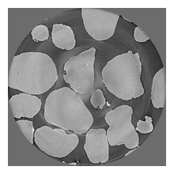
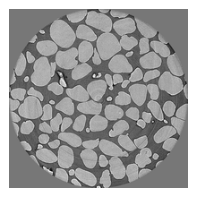
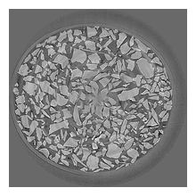
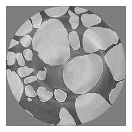
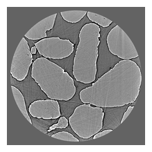
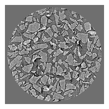
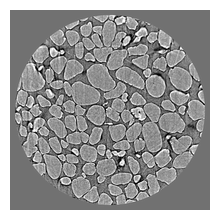
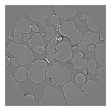
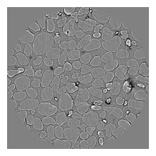
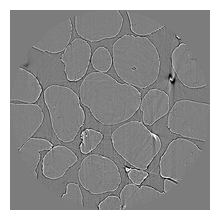
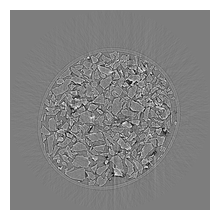
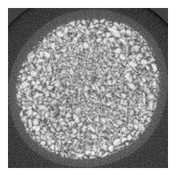
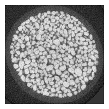
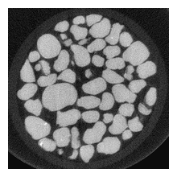

**APS data** 

+----------------------------+-------------------------------------------+---------+
| Name                       | Value                                     | Units   |
+============================+===========================================+=========+
| Tomo ID                    | tomo_00104_                               |         |
+----------------------------+-------------------------------------------+---------+
| TomoLog                    | |d00104|                                  |         |
+----------------------------+-------------------------------------------+---------+
| Instrument                 | APS beamline 2-BM                         |         |
+----------------------------+-------------------------------------------+---------+
| Sample Name                | 30-100                                    |         |
+----------------------------+-------------------------------------------+---------+
| Resolution                 | 0.7016558051109314                        | µm      |
+----------------------------+-------------------------------------------+---------+
| Acquire period             | 0.019528192                               | s       |
+----------------------------+-------------------------------------------+---------+
| Energy                     | 30.0 (pink)                               | keV     |
+----------------------------+-------------------------------------------+---------+
| Sample to detector distance| 120.0                                     | mm      |
+----------------------------+-------------------------------------------+---------+

+----------------------------+-------------------------------------------+---------+
| Name                       | Value                                     | Units   |
+============================+===========================================+=========+
| Tomo ID                    | tomo_00105_                               |         |
+----------------------------+-------------------------------------------+---------+
| TomoLog                    | |d00105|                                  |         |
+----------------------------+-------------------------------------------+---------+
| Instrument                 | APS beamline 2-BM                         |         |
+----------------------------+-------------------------------------------+---------+
| Sample Name                | 70-200                                    |         |
+----------------------------+-------------------------------------------+---------+
| Resolution                 | 0.7016558051109314                        | µm      |
+----------------------------+-------------------------------------------+---------+
| Acquire period             | 0.019528192                               | s       |
+----------------------------+-------------------------------------------+---------+
| Energy                     | 30.0 (pink)                               | keV     |
+----------------------------+-------------------------------------------+---------+
| Sample to detector distance| 120.0                                     | mm      |
+----------------------------+-------------------------------------------+---------+

+----------------------------+-------------------------------------------+---------+
| Name                       | Value                                     | Units   |
+============================+===========================================+=========+
| Tomo ID                    | tomo_00106_                               |         |
+----------------------------+-------------------------------------------+---------+
| TomoLog                    | |d00106|                                  |         |
+----------------------------+-------------------------------------------+---------+
| Instrument                 | APS beamline 2-BM                         |         |
+----------------------------+-------------------------------------------+---------+
| Sample Name                | 100-325                                   |         |
+----------------------------+-------------------------------------------+---------+
| Resolution                 | 0.7016558051109314                        | µm      |
+----------------------------+-------------------------------------------+---------+
| Acquire period             | 0.019528192                               | s       |
+----------------------------+-------------------------------------------+---------+
| Energy                     | 30.0 (pink)                               | keV     |
+----------------------------+-------------------------------------------+---------+
| Sample to detector distance| 120.0                                     | mm      |
+----------------------------+-------------------------------------------+---------+

+----------------------------+-------------------------------------------+---------+
| Name                       | Value                                     | Units   |
+============================+===========================================+=========+
| Tomo ID                    | tomo_00107_                               |         |
+----------------------------+-------------------------------------------+---------+
| TomoLog                    | |d00107|                                  |         |
+----------------------------+-------------------------------------------+---------+
| Instrument                 | APS beamline 2-BM                         |         |
+----------------------------+-------------------------------------------+---------+
| Sample Name                | 30-100+70-200 mix                         |         |
+----------------------------+-------------------------------------------+---------+
| Resolution                 | 0.7016558051109314                        | µm      |
+----------------------------+-------------------------------------------+---------+
| Acquire period             | 0.019528192                               | s       |
+----------------------------+-------------------------------------------+---------+
| Energy                     | 30.0 (pink)                               | keV     |
+----------------------------+-------------------------------------------+---------+
| Sample to detector distance| 120.0                                     | mm      |
+----------------------------+-------------------------------------------+---------+

**ALS data**

+----------------------------+------------------------------------------------------+---------+
| Name                       | Value                                                | Units   |
+============================+======================================================+=========+
| Tomo ID                    | 20240425_112716_nist-sand-30-100_27keV_z8mm_n2625    |         |
+----------------------------+------------------------------------------------------+---------+
| TomoLog                    | |d00108|                                             |         |
+----------------------------+------------------------------------------------------+---------+
| Instrument                 | ALS micro-CT                                         |         |
+----------------------------+------------------------------------------------------+---------+
| Sample Name                | 30-100                                               |         |
+----------------------------+------------------------------------------------------+---------+
| Resolution                 | 0.65                                                 | µm      |
+----------------------------+------------------------------------------------------+---------+
| Acquire period             | 0.15                                                 | s       |
+----------------------------+------------------------------------------------------+---------+
| Energy                     | 27                                                   | keV     |
+----------------------------+------------------------------------------------------+---------+
| Sample to detector distance| 9.837348                                             | mm      |
+----------------------------+------------------------------------------------------+---------+

+----------------------------+------------------------------------------------------+---------+
| Name                       | Value                                                | Units   |
+============================+======================================================+=========+
| Tomo ID                    | 20240425_144547_nist-sand-70-200_27keV_z8mm_n2625    |         |
+----------------------------+------------------------------------------------------+---------+
| TomoLog                    | |d00109|                                             |         |
+----------------------------+------------------------------------------------------+---------+
| Instrument                 | ALS micro-CT                                         |         |
+----------------------------+------------------------------------------------------+---------+
| Sample Name                | 70-200                                               |         |
+----------------------------+------------------------------------------------------+---------+
| Resolution                 | 0.65                                                 | µm      |
+----------------------------+------------------------------------------------------+---------+
| Acquire period             | 0.15                                                 | s       |
+----------------------------+------------------------------------------------------+---------+
| Energy                     | 27                                                   | keV     |
+----------------------------+------------------------------------------------------+---------+
| Sample to detector distance| 9.488894                                             | mm      |
+----------------------------+------------------------------------------------------+---------+

+----------------------------+------------------------------------------------------+---------+
| Name                       | Value                                                | Units   |
+============================+======================================================+=========+
| Tomo ID                    | 20240425_153137_nist-sand-100-325_27keV_z8mm_n2625   |         |
+----------------------------+------------------------------------------------------+---------+
| TomoLog                    | |d00110|                                             |         |
+----------------------------+------------------------------------------------------+---------+
| Instrument                 | ALS micro-CT                                         |         |
+----------------------------+------------------------------------------------------+---------+
| Sample Name                | 100-325                                              |         |
+----------------------------+------------------------------------------------------+---------+
| Resolution                 | 0.65                                                 | µm      |
+----------------------------+------------------------------------------------------+---------+
| Acquire period             | 0.15                                                 | s       |
+----------------------------+------------------------------------------------------+---------+
| Energy                     | 27                                                   | keV     |
+----------------------------+------------------------------------------------------+---------+
| Sample to detector distance| 9.413548                                             | mm      |
+----------------------------+------------------------------------------------------+---------+

+----------------------------+------------------------------------------------------+-------+
| Name                       | Value                                                | Units |
+============================+======================================================+=======+
| Tomo ID                    | 20240425_161650_nist-sand-30-200-mix_27keV_z8mm_n2625|       |
+----------------------------+------------------------------------------------------+-------+
| TomoLog                    | |d00111|                                             |       |
+----------------------------+------------------------------------------------------+-------+
| Instrument                 | ALS micro-CT                                         |       |
+----------------------------+------------------------------------------------------+-------+
| Sample Name                | 30-100+70-200 mix                                    |       |
+----------------------------+------------------------------------------------------+-------+
| Resolution                 | 0.65                                                 | µm    |
+----------------------------+------------------------------------------------------+-------+
| Acquire period             | 0.15                                                 | s     |
+----------------------------+------------------------------------------------------+-------+
| Energy                     | 27                                                   | keV   |
+----------------------------+------------------------------------------------------+-------+
| Sample to detector distance| 9.458861                                             | mm    |
+----------------------------+------------------------------------------------------+-------+

**Diamond Light Source data**

+----------------------------+-----------------------------------------+---------+
| Name                       | Value                                   | Units   |
+============================+=========================================+=========+
| Tomo ID                    | Savu_k11-38727_full_fd_vo_AST_tiff      |         |
+----------------------------+-----------------------------------------+---------+
| TomoLog                    | |d00112|                                |         |
+----------------------------+-----------------------------------------+---------+
| Instrument                 | Diamond K11 DIAD                        |         |
+----------------------------+-----------------------------------------+---------+
| Sample Name                | 30-100                                  |         |
+----------------------------+-----------------------------------------+---------+
| Resolution                 | 0.54                                    | µm      |
+----------------------------+-----------------------------------------+---------+
| Acquire period             | 0.06                                    | s       |
+----------------------------+-----------------------------------------+---------+
| Energy                     | Pink beam (low angle), 4 mm Alu filter  |         |
+----------------------------+-----------------------------------------+---------+
| Sample to detector distance|                                         |         |
+----------------------------+-----------------------------------------+---------+

+----------------------------+-----------------------------------------+---------+
| Name                       | Value                                   | Units   |
+============================+=========================================+=========+
| Tomo ID                    | Savu_k11-38740_full_fd_vo_AST_tiff      |         |
+----------------------------+-----------------------------------------+---------+
| TomoLog                    | |d00113|                                |         |
+----------------------------+-----------------------------------------+---------+
| Instrument                 | Diamond K11 DIAD                        |         |
+----------------------------+-----------------------------------------+---------+
| Sample Name                | 100-325                                 |         |
+----------------------------+-----------------------------------------+---------+
| Resolution                 | 0.54                                    | µm      |
+----------------------------+-----------------------------------------+---------+
| Acquire period             | 0.06                                    | s       |
+----------------------------+-----------------------------------------+---------+
| Energy                     | Pink beam (low angle), 4 mm Alu filter  |         |
+----------------------------+-----------------------------------------+---------+
| Sample to detector distance|                                         |         |
+----------------------------+-----------------------------------------+---------+

+----------------------------+-----------------------------------------+---------+
| Name                       | Value                                   | Units   |
+============================+=========================================+=========+
| Tomo ID                    | Savu_k11-38751_full_fd_vo_AST_tiff      |         |
+----------------------------+-----------------------------------------+---------+
| TomoLog                    | |d00114|                                |         |
+----------------------------+-----------------------------------------+---------+
| Instrument                 | Diamond K11 DIAD                        |         |
+----------------------------+-----------------------------------------+---------+
| Sample Name                | 70-200                                  |         |
+----------------------------+-----------------------------------------+---------+
| Resolution                 | 0.54                                    | µm      |
+----------------------------+-----------------------------------------+---------+
| Acquire period             | 0.06                                    | s       |
+----------------------------+-----------------------------------------+---------+
| Energy                     | Pink beam (low angle), 4 mm Alu filter  |         |
+----------------------------+-----------------------------------------+---------+
| Sample to detector distance|                                         |         |
+----------------------------+-----------------------------------------+---------+

**NSLS-II data**

+----------------------------+-----------------------------------------+---------+
| Name                       | Value                                   | Units   |
+============================+=========================================+=========+
| Tomo ID                    | HEX_scan_00220                          |         |
+----------------------------+-----------------------------------------+---------+
| TomoLog                    | |d00115|                                |         |
+----------------------------+-----------------------------------------+---------+
| Instrument                 | NSLS-II HEX                             |         |
+----------------------------+-----------------------------------------+---------+
| Sample Name                | 30-100+70-200 mix                       |         |
+----------------------------+-----------------------------------------+---------+
| Resolution                 | 0.65                                    | µm      |
+----------------------------+-----------------------------------------+---------+
| Acquire period             | 0.2                                     | s       |
+----------------------------+-----------------------------------------+---------+
| Energy                     | 45                                      | keV     |
+----------------------------+-----------------------------------------+---------+
| Sample to detector distance|  1500                                   |  mm     |
+----------------------------+-----------------------------------------+---------+

+----------------------------+-----------------------------------------+---------+
| Name                       | Value                                   | Units   |
+============================+=========================================+=========+
| Tomo ID                    | HEX_scan_00222                          |         |
+----------------------------+-----------------------------------------+---------+
| TomoLog                    | |d00116|                                |         |
+----------------------------+-----------------------------------------+---------+
| Instrument                 | NSLS-II HEX                             |         |
+----------------------------+-----------------------------------------+---------+
| Sample Name                | 70-200                                  |         |
+----------------------------+-----------------------------------------+---------+
| Resolution                 | 0.65                                    | µm      |
+----------------------------+-----------------------------------------+---------+
| Acquire period             | 0.2                                     | s       |
+----------------------------+-----------------------------------------+---------+
| Energy                     | 45                                      |  keV    |
+----------------------------+-----------------------------------------+---------+
| Sample to detector distance| 1500                                    |   mm    |
+----------------------------+-----------------------------------------+---------+

+----------------------------+-----------------------------------------+---------+
| Name                       | Value                                   | Units   |
+============================+=========================================+=========+
| Tomo ID                    | HEX_scan_00224                          |         |
+----------------------------+-----------------------------------------+---------+
| TomoLog                    | |d00117|                                |         |
+----------------------------+-----------------------------------------+---------+
| Instrument                 | NSLS-II HEX                             |         |
+----------------------------+-----------------------------------------+---------+
| Sample Name                | 30-100                                  |         |
+----------------------------+-----------------------------------------+---------+
| Resolution                 | 0.65                                    | µm      |
+----------------------------+-----------------------------------------+---------+
| Acquire period             | 0.2                                     | s       |
+----------------------------+-----------------------------------------+---------+
| Energy                     | 45                                      | keV     |
+----------------------------+-----------------------------------------+---------+
| Sample to detector distance| 1600                                    | mm      |
+----------------------------+-----------------------------------------+---------+

+----------------------------+-----------------------------------------+---------+
| Name                       | Value                                   | Units   |
+============================+=========================================+=========+
| Tomo ID                    | HEX_scan_00226                          |         |
+----------------------------+-----------------------------------------+---------+
| TomoLog                    | |d00118|                                |         |
+----------------------------+-----------------------------------------+---------+
| Instrument                 | NSLS-II HEX                             |         |
+----------------------------+-----------------------------------------+---------+
| Sample Name                | 100-325                                 |         |
+----------------------------+-----------------------------------------+---------+
| Resolution                 | 0.65                                    | µm      |
+----------------------------+-----------------------------------------+---------+
| Acquire period             | 0.2                                     | s       |
+----------------------------+-----------------------------------------+---------+
| Energy                     | 45                                      | keV     |
+----------------------------+-----------------------------------------+---------+
| Sample to detector distance| 1600                                    |         |
+----------------------------+-----------------------------------------+---------+

**PNNL data**

+------------------------------+-----------------------------------------+---------+
| Name                         | Value                                   | Units   |
+==============================+=========================================+=========+
| Tomo ID                      | NIST_std_C_30-100_fast_8b-stack         |         |
+------------------------------+-----------------------------------------+---------+
| TomoLog                      | |d00119|                                |         |
+------------------------------+-----------------------------------------+---------+
| Instrument                   | PNNL Nikon XTH 225/320                  |         |
+------------------------------+-----------------------------------------+---------+
| Sample Name                  | 30-100                                  |         |
+------------------------------+-----------------------------------------+---------+
| Voxel Size                   | 2.63                                    | µm      |
+------------------------------+-----------------------------------------+---------+
| Exposure time per projection | 0.5                                     | s       |
+------------------------------+-----------------------------------------+---------+
| X-ray Power                  | 19.95                                   | W       |
+------------------------------+-----------------------------------------+---------+

+------------------------------+-----------------------------------------+---------+
| Name                         | Value                                   | Units   |
+==============================+=========================================+=========+
| Tomo ID                      | NIST_std_A_100-325_fast_8b-stack        |         |
+------------------------------+-----------------------------------------+---------+
| TomoLog                      | |d00120|                                |         |
+------------------------------+-----------------------------------------+---------+
| Instrument                   | PNNL Nikon XTH 225/320                  |         |
+------------------------------+-----------------------------------------+---------+
| Sample Name                  | 100-325                                 |         |
+------------------------------+-----------------------------------------+---------+
| Voxel Size                   | 2.63                                    | µm      |
+------------------------------+-----------------------------------------+---------+
| Exposure time per projection | 0.5                                     | s       |
+------------------------------+-----------------------------------------+---------+
| X-ray Power                  | 19.95                                   | W       |
+------------------------------+-----------------------------------------+---------+

+------------------------------+-----------------------------------------+---------+
| Name                         | Value                                   | Units   |
+==============================+=========================================+=========+
| Tomo ID                      | NIST_std_B_70-200_fast_8b-stack         |         |
+------------------------------+-----------------------------------------+---------+
| TomoLog                      | |d00121|                                |         |
+------------------------------+-----------------------------------------+---------+
| Instrument                   | PNNL Nikon XTH 225/320                  |         |
+------------------------------+-----------------------------------------+---------+
| Sample Name                  | 70-200                                  |         |
+------------------------------+-----------------------------------------+---------+
| Voxel Size                   | 2.63                                    | µm      |
+------------------------------+-----------------------------------------+---------+
| Exposure time per projection | 0.5                                     | s       |
+------------------------------+-----------------------------------------+---------+
| X-ray Power                  | 19.95                                   | W       |
+------------------------------+-----------------------------------------+---------+

**SSRL data**

To be completed

**Acknowledgments**

We gratefully acknowledge the contributions of the following collaborators to the
round-robin sand dataset effort:

* Alexander Hexemer <ahexemer@lbl.gov>
* Sharif Ahmed <sharif.ahmed@diamond.ac.uk>
* Wiebke Koepp <wkoepp@lbl.gov>
* Tanny Chavez <tanchavez@lbl.gov>
* Dylan McReynolds <dmcreynolds@lbl.gov>
* Petrus Zwart <phzwart@lbl.gov>
* Tim Snow <tim.snow@diamond.ac.uk>
* Xiaoya Chong <xchong@lbl.gov>
* Nghia Vo <nvo@bnl.gov>
* Tamas Varga <Tamas.Varga@pnnl.gov>
* Dilworth (Dula) Parkinson <dyparkinson@lbl.gov>
* Francesco De Carlo <decarlo@anl.gov>
* Johanna Nelson Weker <jlnelson@slac.stanford.edu>
